## Collapsed section
You can temporarily obscure sections of your Markdown by creating a collapsed section that the reader can choose to expand. For example, when you want to include technical details in an issue comment that may not be relevant or interesting to every reader, you can put those details in a collapsed section.

Any Markdown within the `<details>` block will be collapsed until the reader clicks  to expand the details.

Within the `<details>` block, use the `<summary>` tag to let readers know what is inside. The label appears to the right of ▶ .

````markdown
<details>

<summary>Tips for collapsed sections</summary>

### You can add a header

You can add text within a collapsed section. 

You can add an image or a code block, too.

```ruby
   puts "Hello World"
```

</details>
````

<details>

<summary>Tips for collapsed sections</summary>

### You can add a header

You can add text within a collapsed section. 

You can add an image or a code block, too.

```ruby
   puts "Hello World"
```

</details>

## Creating diagrams

You can create diagrams in Markdown using three different syntaxes: mermaid, geoJSON and topoJSON, and ASCII STL. Diagram rendering is available in GitHub Issues, GitHub Discussions, pull requests, wikis, and Markdown files.

### Creating Mermaid diagrams
Mermaid is a Markdown-inspired tool that renders text into diagrams. For example, Mermaid can render flow charts, sequence diagrams, pie charts and more. For more information, see the Mermaid documentation.

To create a Mermaid diagram, add Mermaid syntax inside a fenced code block with the mermaid language identifier. For more information about creating code blocks, see "Creating and highlighting code blocks."

For example, you can create a flow chart by specifying values and arrows.

Here is a simple flow chart:


There is multiple types of diagram available in mermaid:

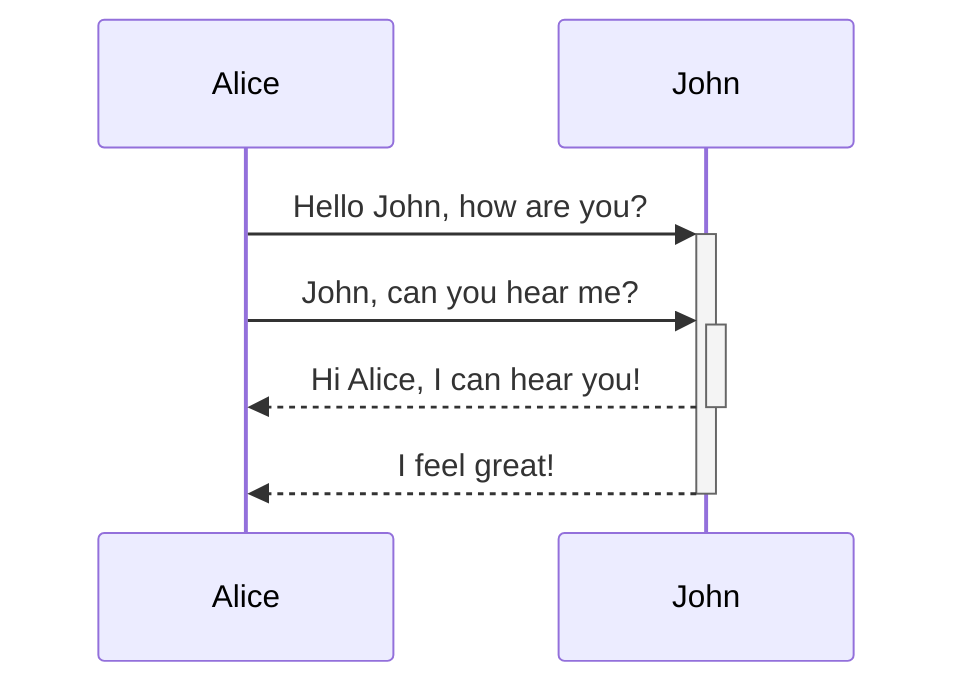

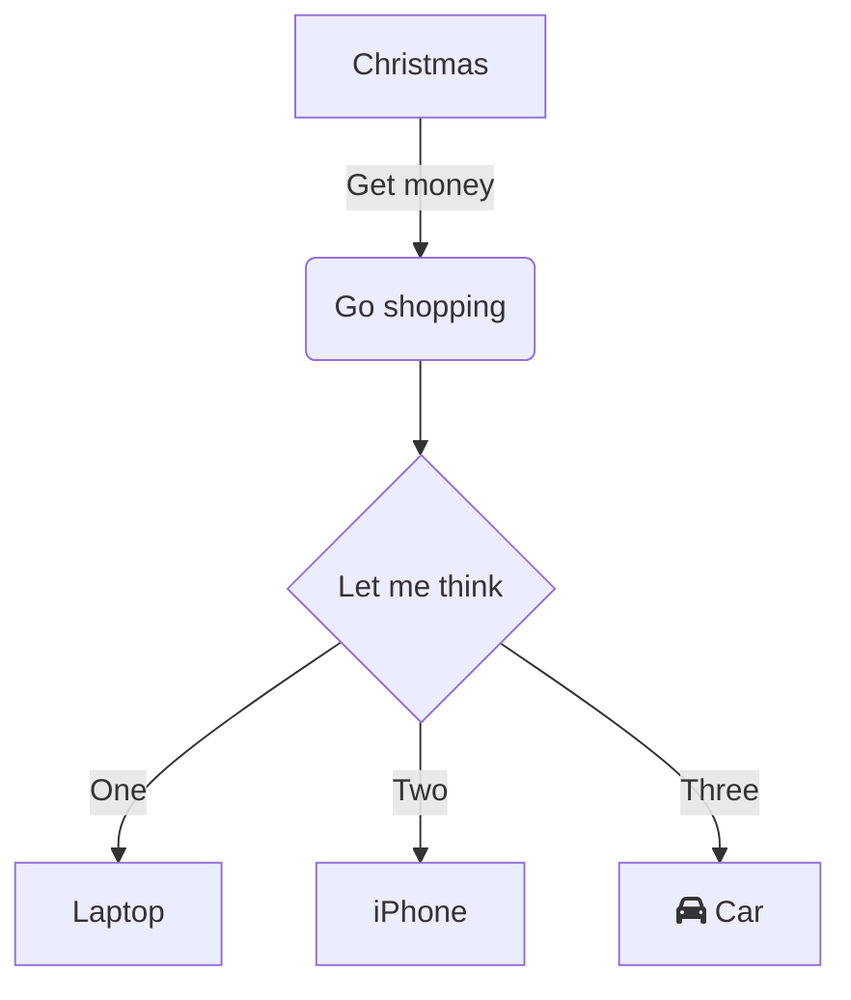

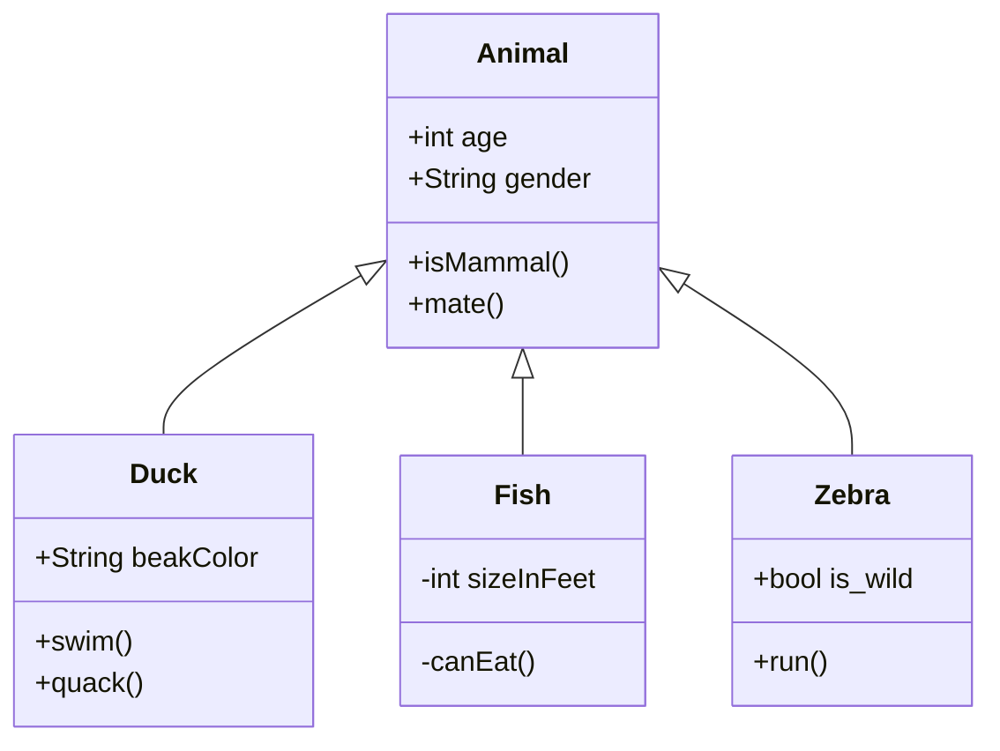

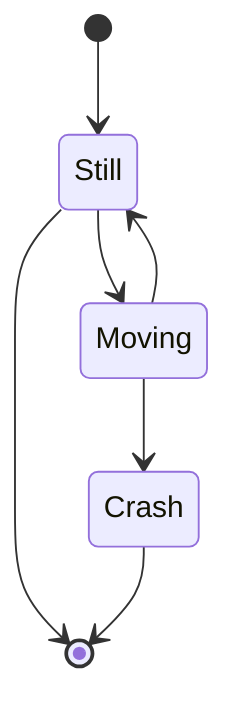

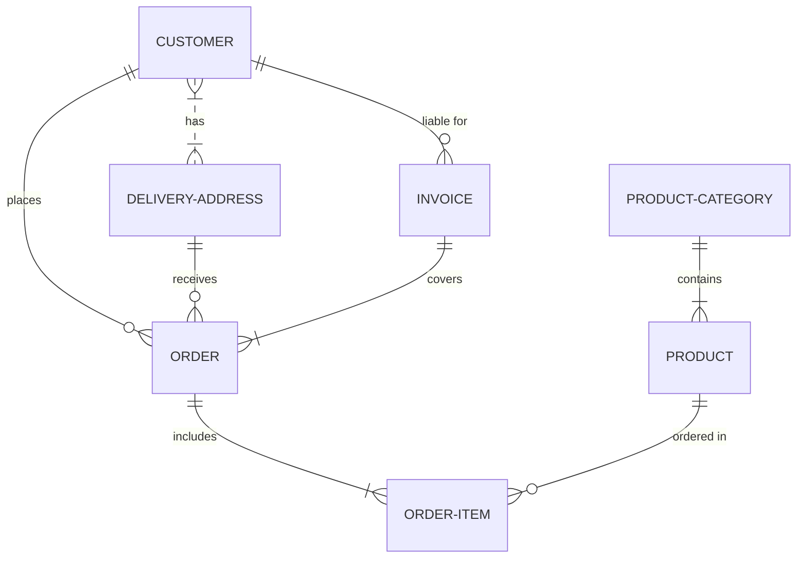

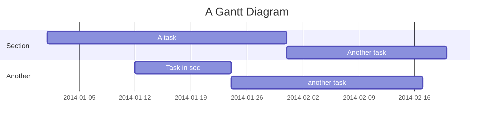

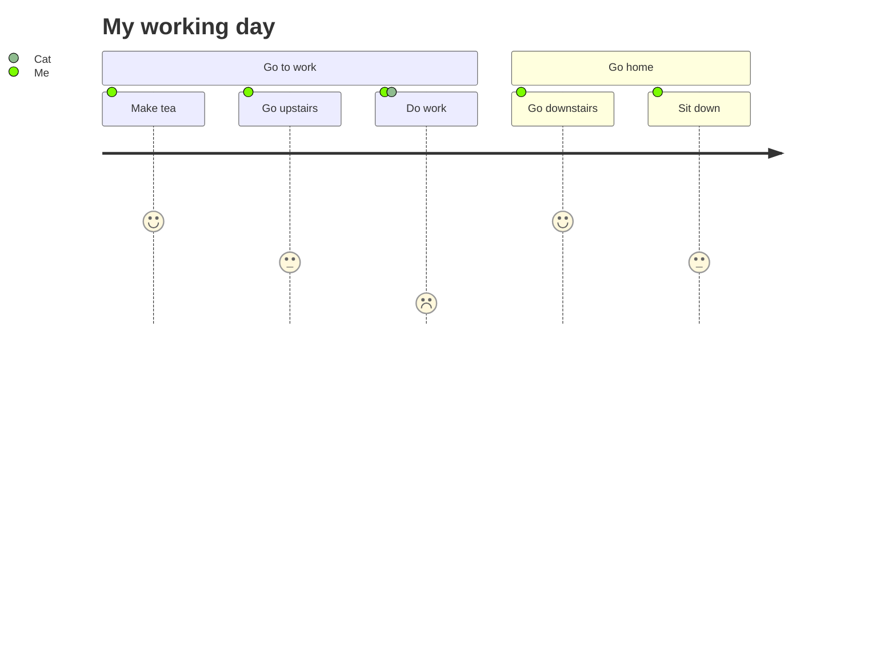


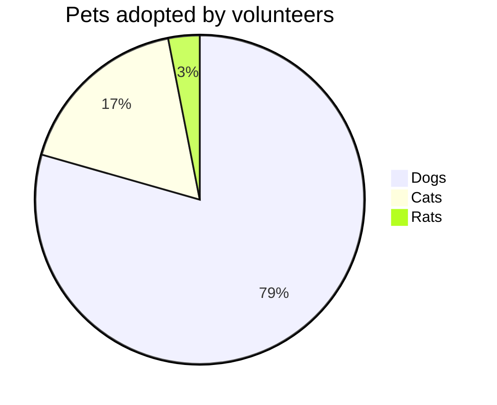

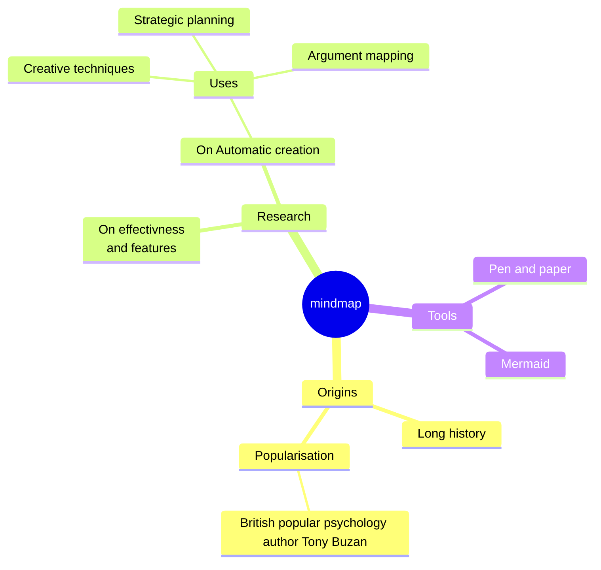

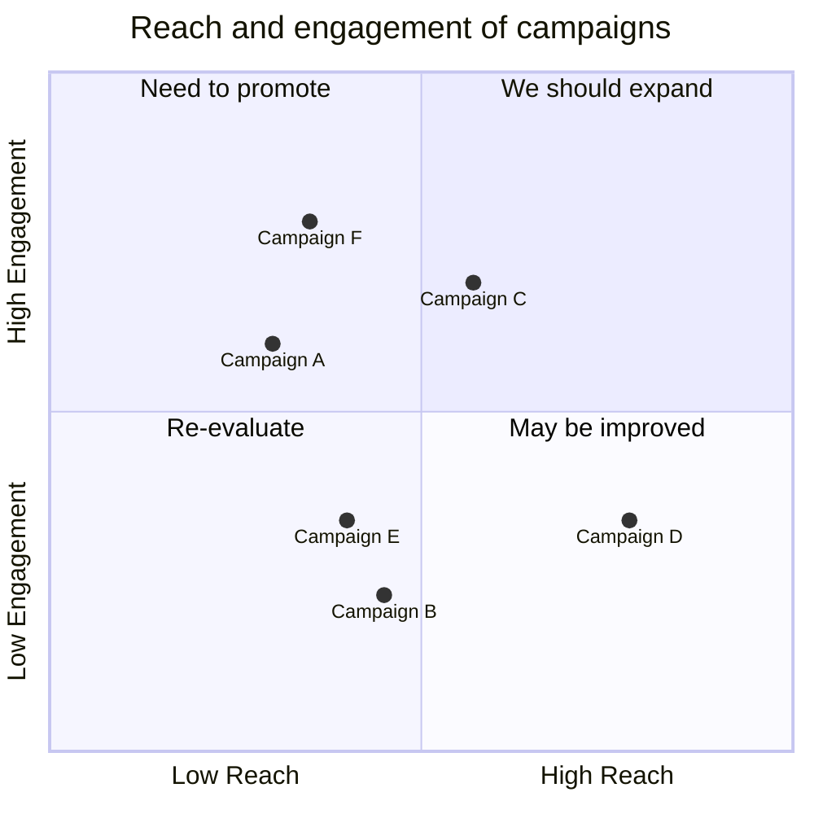

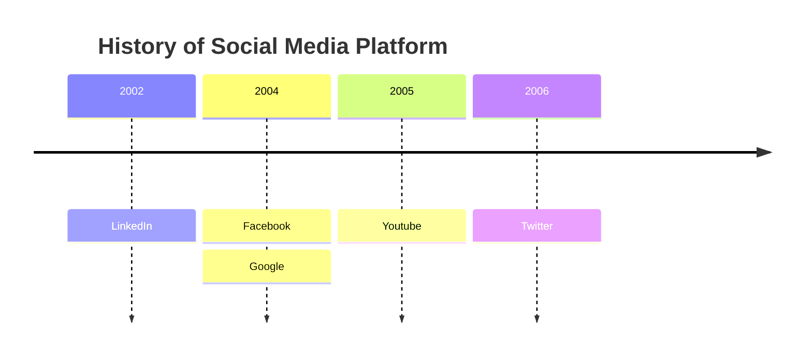

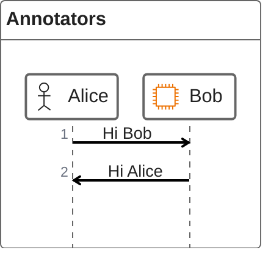