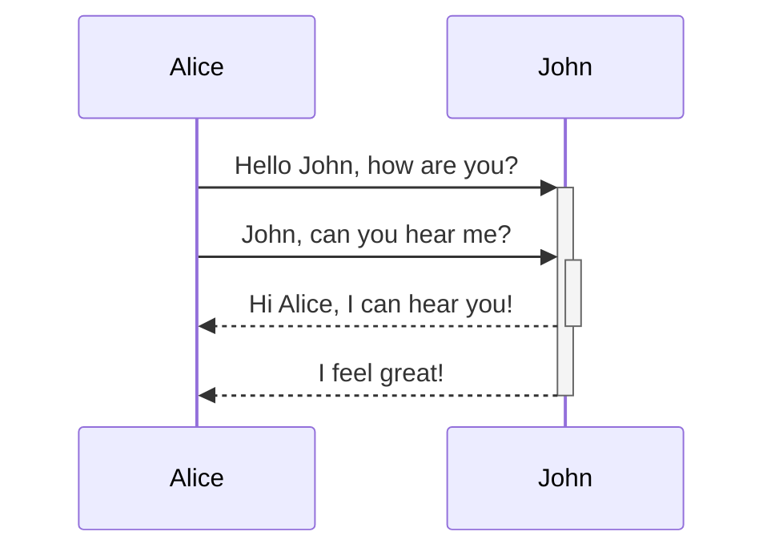
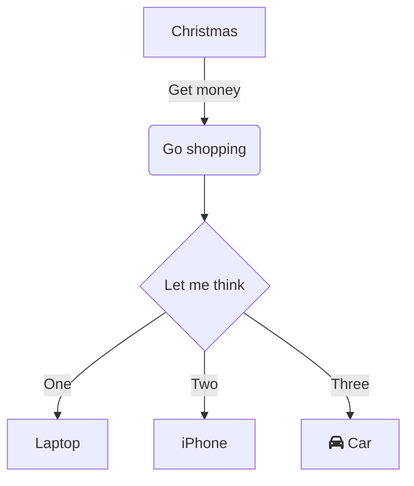
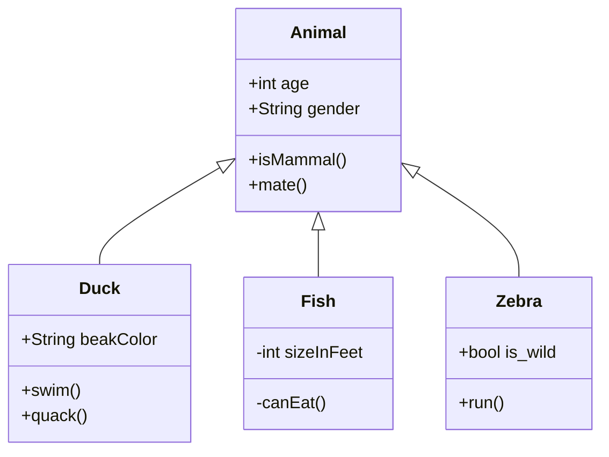
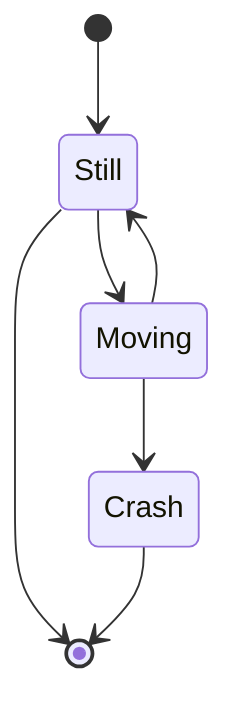
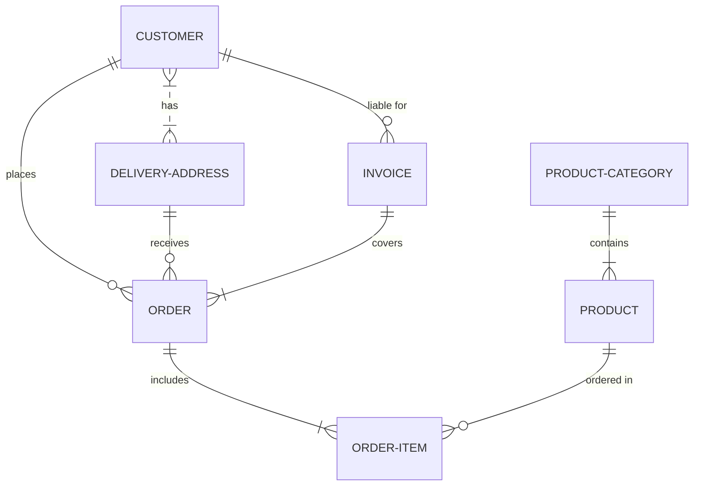
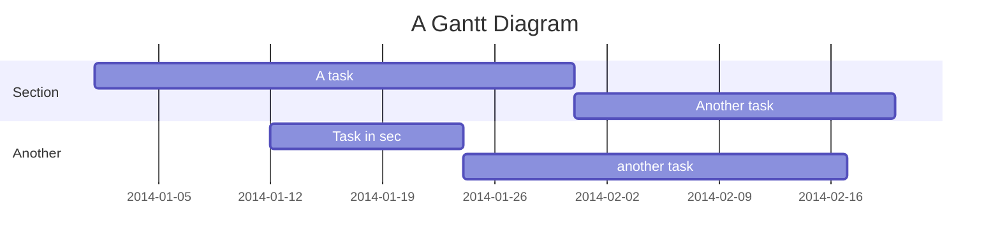
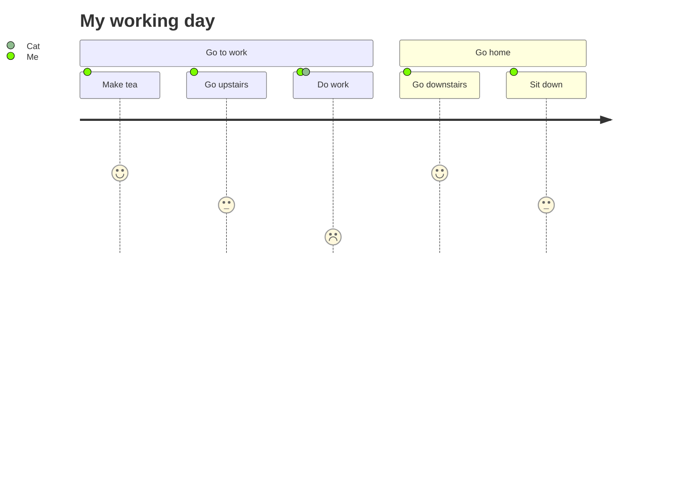
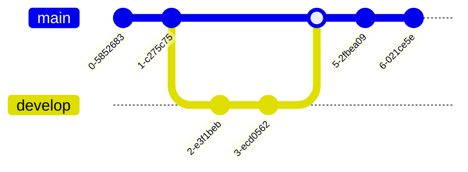
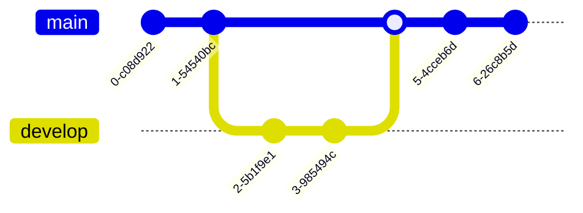
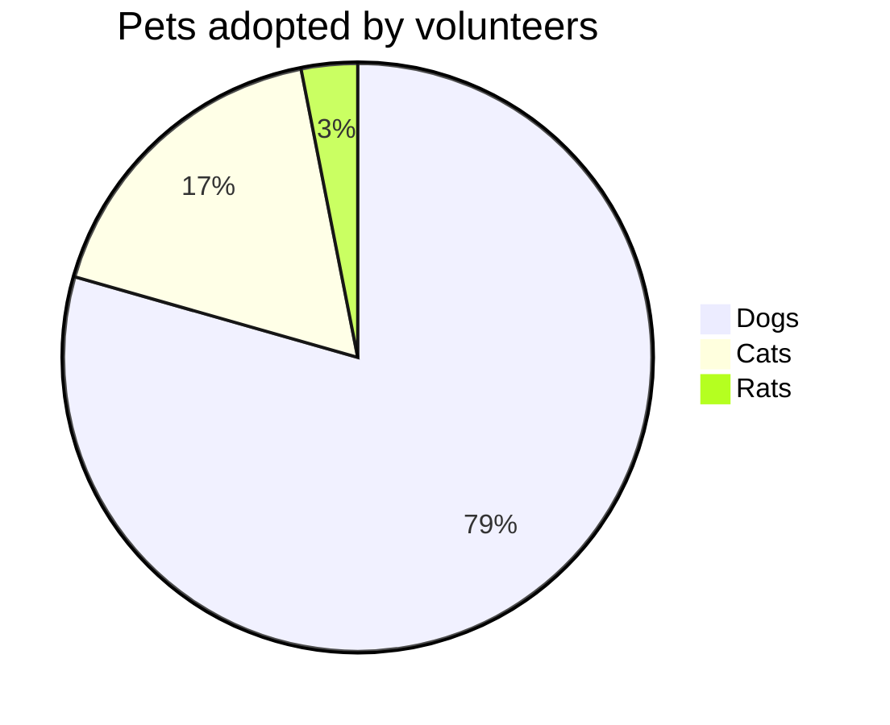

## Collapsed section
You can temporarily obscure sections of your Markdown by creating a collapsed section that the reader can choose to expand. For example, when you want to include technical details in an issue comment that may not be relevant or interesting to every reader, you can put those details in a collapsed section.

Any Markdown within the `<details>` block will be collapsed until the reader clicks  to expand the details.

Within the `<details>` block, use the `<summary>` tag to let readers know what is inside. The label appears to the right of ▶ .

````markdown
<details>

<summary>Tips for collapsed sections</summary>

### You can add a header

You can add text within a collapsed section. 

You can add an image or a code block, too.

```ruby
   puts "Hello World"
```

</details>
````

<details>

<summary>Tips for collapsed sections</summary>

### You can add a header

You can add text within a collapsed section. 

You can add an image or a code block, too.

```ruby
   puts "Hello World"
```

</details>

## Creating diagrams

You can create diagrams in Markdown using three different syntaxes: mermaid, geoJSON and topoJSON, and ASCII STL. Diagram rendering is available in GitHub Issues, GitHub Discussions, pull requests, wikis, and Markdown files.

### Creating Mermaid diagrams
Mermaid is a Markdown-inspired tool that renders text into diagrams. For example, Mermaid can render flow charts, sequence diagrams, pie charts and more. For more information, see the [Mermaid documentation](https://mermaid.js.org/intro/).

To create a Mermaid diagram, add Mermaid syntax inside a fenced code block with the mermaid language identifier. For more information about creating code blocks, see "Creating and highlighting code blocks."

For example, you can create a flow chart by specifying values and arrows.

Here is a simple flow chart:

````markdown

````

The diagram will be shown below if viewed in the Github interface


There is multiple types of diagram available with the mermaid syntax. Some won't be displayed automatically by the Github UI though but most of them will.

#### Sequence Diagram

````

````


#### Flowchart

````

````


#### Class diagram

````

````


#### State diagram

````

````


#### Entity-Relationship Diagram

````

````


#### Gantt Diagram
````

````


#### User Journey Diagram

````

````


#### Git graph Diagrams

````

````



#### Pie Chart

````

````


#### Mindmap

````
```mermaid
mindmap
  root((mindmap))
    Origins
      Long history
      ::icon(fa fa-book)
      Popularisation
        British popular psychology author Tony Buzan
    Research
      On effectivness<br/>and features
      On Automatic creation
        Uses
            Creative techniques
            Strategic planning
            Argument mapping
    Tools
      Pen and paper
      Mermaid
```
````

```mermaid
mindmap
  root((mindmap))
    Origins
      Long history
      ::icon(fa fa-book)
      Popularisation
        British popular psychology author Tony Buzan
    Research
      On effectivness<br/>and features
      On Automatic creation
        Uses
            Creative techniques
            Strategic planning
            Argument mapping
    Tools
      Pen and paper
      Mermaid
```

#### Timeline Diagram

````
```mermaid
timeline
    title History of Social Media Platform
    2002 : LinkedIn
    2004 : Facebook : Google
    2005 : Youtube
    2006 : Twitter
```
````

```mermaid
timeline
    title History of Social Media Platform
    2002 : LinkedIn
    2004 : Facebook : Google
    2005 : Youtube
    2006 : Twitter
```

### Creating GeoJSON and TopoJSON maps

You can use GeoJSON or TopoJSON syntax to create interactive maps. To create a map, add GeoJSON or TopoJSON inside a fenced code block with the `geojson` or `topojson` syntax identifier

#### Using GeoJSON

For example, you can create a map by specifying coordinates.

````
```geojson
{
  "type": "FeatureCollection",
  "features": [
    {
      "type": "Feature",
      "id": 1,
      "properties": {
        "ID": 0
      },
      "geometry": {
        "type": "Polygon",
        "coordinates": [
          [
              [-90,35],
              [-90,30],
              [-85,30],
              [-85,35],
              [-90,35]
          ]
        ]
      }
    }
  ]
}
```
````

```geojson
{
  "type": "FeatureCollection",
  "features": [
    {
      "type": "Feature",
      "id": 1,
      "properties": {
        "ID": 0
      },
      "geometry": {
        "type": "Polygon",
        "coordinates": [
          [
              [-90,35],
              [-90,30],
              [-85,30],
              [-85,35],
              [-90,35]
          ]
        ]
      }
    }
  ]
}
```